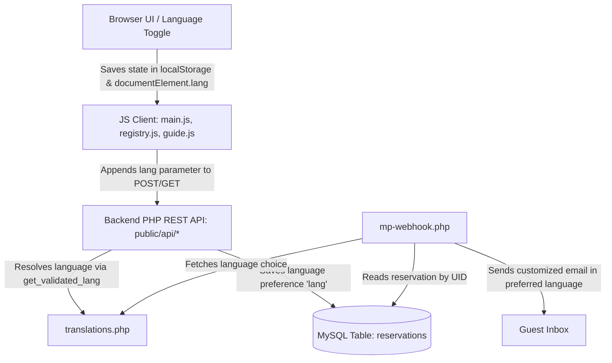

# Multi-Language (i18n) Workflow Guide

This project supports **six official languages** by default: English (`en`), Spanish (`es`), French (`fr`), Italian (`it`), German (`de`), and Japanese (`ja`). When adding, modifying, or refactoring text or features, you must preserve the language context across the entire application stack.

---

## 🏗️ The End-to-End Language Pipeline

To pass, store, and display language selections, follow this data flow:



---

## 💻 Frontend Localizations (`src/i18n/dict.ts`)

Never write plain text inside React files under `src/pages/` or `src/components/`. All strings must be declared inside `src/i18n/dict.ts`.

### 1. Structure
Add your keys under the appropriate section of the dictionary, ensuring translations are provided for all 6 keys (`en`, `es`, `fr`, `it`, `de`, `ja`):
```typescript
export const dict = {
  en: {
    section_key: {
      my_text: "My English string"
    }
  },
  es: {
    section_key: {
      my_text: "Mi string en español"
    }
  },
  // Include fr, it, de, ja...
};
```

### 2. Rendering in React Components
Ensure that your component accepts the `lang` prop and pulls the matching translated fragment:
```typescript
interface ComponentProps {
  lang: string;
}

export function MyComponent({ lang }: ComponentProps) {
  const t = dict[lang as keyof typeof dict] || dict.en;
  
  return (
    <div>{t.section_key.my_text}</div>
  );
}
```

---

## 🔌 Backend Localizations (`public/api/translations.php`)

All validation errors, form responses, CAPTCHA challenges, and transactional receipts are stored centrally in `/public/api/translations.php`.

### 1. Structure
Organize your backend translations neatly within the module-specific arrays (e.g., `booking`, `contact`, `registry`, `webhook`):
```php
return [
    'en' => [
        'contact' => [
            'err_name_required' => 'Please enter your name.',
        ],
        'webhook' => [
            'email_subject' => 'Reservation Confirmed!',
        ]
    ],
    'es' => [
        'contact' => [
            'err_name_required' => 'Por favor, ingrese su nombre.',
        ],
        'webhook' => [
            'email_subject' => '¡Reservación Confirmada!',
        ]
    ],
    // Include fr, it, de, ja...
];
```

### 2. Loading Translations in PHP scripts
Always load translations using the unified whitelister `get_validated_lang()` helper inside `utils.php`:
```php
$lang = get_validated_lang();
$t = $all_translations[$lang]['contact'] ?? $all_translations['en']['contact'];
```

---

## ⚡ Client-Side Parameters Passing

When making any fetch requests or redirects, you must append the resolved language parameter.

### 1. Appending to fetch/AJAX GET queries
```javascript
const currentLang = document.documentElement.lang || 'en';
const response = await fetch(`/api/book-request.php?action=captcha&lang=${currentLang}`);
```

### 2. Appending to FormData POST payloads
```javascript
const formData = new FormData(formElement);
formData.append('lang', document.documentElement.lang || 'en');
```

### 3. Preserving Language context in Redirections
When redirecting users or building dynamic links (such as navigating from the Guest Welcome Guide to the Guest Registry), ensure the language is preserved as a query parameter or directory route:
```javascript
const pageName = lang === 'en' ? 'registry/index.html' : `registry/${lang}.html`;
const regParams = new URLSearchParams();
regParams.set('lang', lang);
registryLink.href = `${pathPrefix}${pageName}?${regParams.toString()}`;
```

---

## 🔄 dynamic Webhook Notifications & Emails

When dispatching automatic system emails (such as payment receipts from `mercadopago-webhook.php`):
1.  Query the reservation entry from the database.
2.  Retrieve the `lang` preference column.
3.  Sanitize the language code, and fallback to email-based TLD detection if blank or invalid.
4.  Load the sub-array translations from `translations.php` matching the language selection.
5.  Compose and dispatch the HTML email fully customized in the guest's language.

---

## 🚀 Build Verification

Whenever making translation edits or additions:
1.  Run the full generation pipeline to verify zero TypeScript, Vite, or minification issues:
    ```bash
    npm run build
    ```
2.  Audit the output `/dist` folder to ensure that all localized static pages (`index.html`, `es.html`, `fr.html`, etc.) are built perfectly with correct canonical and language tag configurations.
