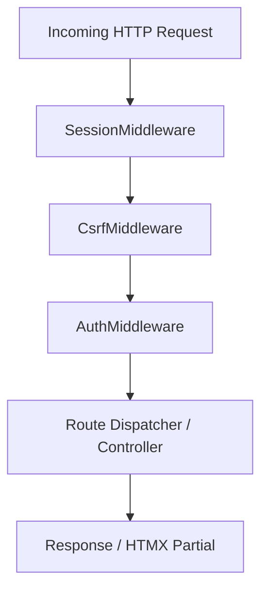

# Admin Session Authentication, CSRF Protection, and Middleware Security Specification

**Issue**: [#28](https://github.com/manuelhe/oceanviewflats/issues/28)  
**Parent Map**: [#24](https://github.com/manuelhe/oceanviewflats/issues/24)  
**ADR**: [ADR 0005: Admin Interface Architecture, Subdomain Isolation, and Monorepo Integration](../adr/0005-admin-interface-architecture-and-subdomain-isolation.md)

---

## 1. Subdomain Session Configuration & Isolation

The administrative interface is hosted on an isolated subdomain (`admin.oceanviewflats.com`). Administrative session cookies must never leak to the public apex domain or guest checkout endpoints, and public cookies must not grant access to admin endpoints.

### Session Parameters
```php
session_name('OVF_ADMIN_SESSID');

session_set_cookie_params([
    'lifetime' => 0,                            // Expire when browser closes
    'path' => '/',                              // Valid across all admin routes
    'domain' => $_SERVER['SERVER_NAME'] ?? '',  // Scoped strictly to current host/subdomain
    'secure' => (!empty($_SERVER['HTTPS']) && $_SERVER['HTTPS'] !== 'off'), // HTTPS required in prod
    'httponly' => true,                         // Inaccessible to JavaScript (XSS defense)
    'samesite' => 'Strict'                      // Block third-party cookie transmission
]);
```

### Inactivity & Absolute Expiry
* **Idle Timeout**: 1,800 seconds (30 minutes). If `time() - $_SESSION['last_activity'] > 1800`, destroy session and redirect to `/login?reason=idle_timeout`.
* **Absolute Max Lifetime**: 28,800 seconds (8 hours). If `time() - $_SESSION['created_at'] > 28800`, destroy session and redirect to `/login?reason=session_expired`.
* **Fixation Defense**: Invoke `session_regenerate_id(true)` immediately upon successful credential verification.

---

## 2. Password Hashing & Verification (Argon2id)

Authentication validates against the `admin_users` table created in [Issue #27](https://github.com/manuelhe/oceanviewflats/issues/27).

### Hashing Standard
All passwords must use native PHP `PASSWORD_ARGON2ID` with tuned cost factors:
```php
const ARGON2_OPTIONS = [
    'memory_cost' => 65536, // 64 MB
    'time_cost' => 4,       // 4 iterations
    'threads' => 2          // 2 parallel threads
];

// Generation (CLI creation / password reset)
$hash = password_hash($plaintextPassword, PASSWORD_ARGON2ID, ARGON2_OPTIONS);
```

### Verification Flow
```php
$stmt = $pdo->prepare('SELECT * FROM admin_users WHERE email = :email LIMIT 1');
$stmt->execute(['email' => strtolower(trim($email))]);
$user = $stmt->fetch(PDO::FETCH_ASSOC);

if (!$user) {
    // Constant-time dummy verification to thwart user enumeration timing attacks
    password_verify($plaintextPassword, '$argon2id$v=19$m=65536,t=4,p=2$dummyhash...');
    return LoginResult::invalidCredentials();
}

// 1. Account Active Check
if ((int)$user['is_active'] !== 1) {
    return LoginResult::accountDisabled();
}

// 2. Lockout Check
if ($user['locked_until'] !== null && strtotime($user['locked_until']) > time()) {
    $remainingMinutes = ceil((strtotime($user['locked_until']) - time()) / 60);
    return LoginResult::accountLocked($remainingMinutes);
}

// 3. Password Verification
if (!password_verify($plaintextPassword, $user['password_hash'])) {
    recordFailedAttempt($pdo, (int)$user['id'], (int)$user['failed_login_attempts']);
    return LoginResult::invalidCredentials();
}

// 4. Transparent Rehash Check
if (password_needs_rehash($user['password_hash'], PASSWORD_ARGON2ID, ARGON2_OPTIONS)) {
    $newHash = password_hash($plaintextPassword, PASSWORD_ARGON2ID, ARGON2_OPTIONS);
    $updateStmt = $pdo->prepare('UPDATE admin_users SET password_hash = :hash WHERE id = :id');
    $updateStmt->execute(['hash' => $newHash, 'id' => $user['id']]);
}

// 5. Successful Login State Update
$resetStmt = $pdo->prepare('
    UPDATE admin_users 
    SET failed_login_attempts = 0, locked_until = NULL, last_login_at = NOW() 
    WHERE id = :id
');
$resetStmt->execute(['id' => $user['id']]);
```

---

## 3. Brute-Force Rate Limiting & Lockout

### Account-Level Progressive Lockout
* Failed attempts increment `failed_login_attempts` on `admin_users`.
* Upon reaching **5 consecutive failures**, `locked_until` is set to `NOW() + INTERVAL 15 MINUTE`.
* Upon reaching **10 consecutive failures**, `locked_until` is set to `NOW() + INTERVAL 60 MINUTE`.
* Successful login clears `failed_login_attempts` and sets `locked_until = NULL`.

### IP-Level Velocity Defense
* Backed by file or table cache using client IP (`$_SERVER['REMOTE_ADDR']`).
* Limit: Maximum **10 failed login requests per IP per 15 minutes**.
* Excess attempts trigger HTTP `429 Too Many Requests` with `Retry-After: 900`.

---

## 4. HTMX-Compatible CSRF Protection

Because the admin UI is driven by HTMX 2.x partial DOM swaps, CSRF tokens must seamlessly attach to both AJAX requests and traditional HTTP form submissions without manual boilerplate on every button or modal.

### Token Lifecycle
1. On session initialization, generate a 256-bit secure token if absent:
   ```php
   if (empty($_SESSION['csrf_token'])) {
       $_SESSION['csrf_token'] = bin2hex(random_bytes(32));
   }
   ```
2. Tokens rotate only on login, logout, or privilege escalation.

### Client-Side Injection (Root Layout)
In `admin/src/Views/layout.php`, bind the CSRF token to the `<body>` tag using HTMX inheritance:
```html
<body hx-headers='{"HX-CSRF-Token": "<?= htmlspecialchars($_SESSION["csrf_token"], ENT_QUOTES, "UTF-8") ?>"}'>
    <!-- All child hx-post, hx-put, hx-delete, hx-patch inherit this header automatically -->
```
For fallback HTML `<form method="POST">` elements:
```html
<input type="hidden" name="csrf_token" value="<?= htmlspecialchars($_SESSION['csrf_token'], ENT_QUOTES, 'UTF-8') ?>">
```

### Server-Side Middleware Validation
For all state-mutating requests (`POST`, `PUT`, `DELETE`, `PATCH`):
```php
$clientToken = $_SERVER['HTTP_HX_CSRF_TOKEN'] ?? $_POST['csrf_token'] ?? '';
$sessionToken = $_SESSION['csrf_token'] ?? '';

if (empty($sessionToken) || empty($clientToken) || !hash_equals($sessionToken, $clientToken)) {
    http_response_code(403);
    if (!empty($_SERVER['HTTP_HX_REQUEST'])) {
        // HTMX Response
        header('HX-Reswap: none');
        echo '<div class="p-4 bg-red-100 text-red-700 rounded">Security session token expired. Please refresh the page.</div>';
    } else {
        echo '403 Forbidden: Invalid CSRF Token';
    }
    exit;
}
```

---

## 5. Front-Controller Middleware Pipeline

The admin routing entry point (`admin/public/index.php`) executes a linear middleware stack:



1. **`SessionMiddleware`**: Configures cookie params, starts session, validates idle & absolute expiration.
2. **`CsrfMiddleware`**: Validates `HX-CSRF-Token` or `$_POST['csrf_token']` on mutating verbs (`POST`, `PUT`, `DELETE`).
3. **`AuthMiddleware`**:
   - Skips authentication for whitelist: `GET /login`, `POST /login`, `GET /logout`.
   - For all other routes, verifies `$_SESSION['admin_user_id']`.
   - If unauthenticated:
     - If `HX-Request`: Emits `HX-Redirect: /login` header with HTTP `401`.
     - Standard request: Emits `Location: /login` with HTTP `302`.
4. **`AuditLogger` Utility**:
   Injectable service that writes operational changes to `admin_audit_logs`:
   ```php
   AuditLogger::log(
       action: 'pin_override',
       entityType: 'reservation',
       entityId: $reservationUid,
       before: ['door_code' => $oldPin],
       after: ['door_code' => $newPin],
       adminUserId: (int)$_SESSION['admin_user_id']
   );
   ```
