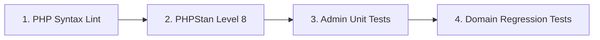

# Independent Admin CI Pipeline & Verification Toolchain Specification

**Issue**: [#31](https://github.com/manuelhe/oceanviewflats/issues/31)  
**Parent Map**: [#24](https://github.com/manuelhe/oceanviewflats/issues/24)  
**Dependencies**: [ADR 0005](../adr/0005-admin-interface-architecture-and-subdomain-isolation.md)

---

## 1. Monorepo CI Strategy & Path Isolation

In accordance with [ADR 0005](../adr/0005-admin-interface-architecture-and-subdomain-isolation.md), the admin interface lives within the single repository at `admin/`. To prevent wasteful runner execution and preserve rapid feedback cycles:
* Changes exclusively affecting the public static site generator (`src/components/`, `src/pages/`, etc.) do **not** trigger the Admin CI pipeline.
* Changes touching administrative code (`admin/**`), shared domain entities (`src/Domain/**`), database migrations (`scripts/schema.sql`, `scripts/migrate.php`), or shared dependency manifests (`composer.json`, `composer.lock`) automatically trigger `.github/workflows/admin-ci.yml`.

### Workflow Trigger Declaration
```yaml
name: Admin CI

on:
  push:
    branches: [main]
    paths:
      - 'admin/**'
      - 'src/Domain/**'
      - '.github/workflows/admin-ci.yml'
      - 'scripts/schema.sql'
      - 'scripts/migrate.php'
      - 'composer.json'
      - 'composer.lock'
  pull_request:
    branches: [main]
    paths:
      - 'admin/**'
      - 'src/Domain/**'
      - '.github/workflows/admin-ci.yml'
      - 'scripts/schema.sql'
      - 'scripts/migrate.php'
      - 'composer.json'
      - 'composer.lock'
  workflow_dispatch:
```

---

## 2. Verification Toolchain & Quality Gates

The pipeline enforces four sequential quality gates:



### Gate 1: PHP Syntax Linting
Executes `php -l` across all files in `admin/` to catch parse errors or invalid tokens prior to test execution:
```bash
find admin -name "*.php" -exec php -l {} +
```

### Gate 2: PHPStan Static Analysis at Level 8 (Strict Typing)
While the public legacy backend API currently targets PHPStan level 5, the new admin codebase enforces **Level 8** strict typing from day one.

**Configuration (`admin/phpstan.neon`)**:
```neon
parameters:
    level: 8
    paths:
        - src
        - tests
    bootstrapFiles:
        - ../vendor/autoload.php
```
* **Level 8 Guarantees**:
  * Strict validation of method arguments and return types.
  * Disallows loose or undocumented mixed types.
  * Enforces null safety checks for nullable parameters and database returns.
  * Ensures array key-value structures are typed where possible.

Command: `composer admin:phpstan`

### Gate 3: Admin Test Suite
Dedicated PHPUnit runner targeting `admin/tests/` configured via `admin/phpunit.xml`:
* Runs with `colors="true"`, `failOnRisky="true"`, `failOnWarning="true"`, and `beStrictAboutOutputDuringTests="true"`.
* Command: `composer admin:test`

### Gate 4: Shared Domain Regression Suite
Because administrative workflows rely on core domain services (`ReservationLedger`, `QuoteEngine`, `DoorCodeGenerator`, `PdoRateSource`), the CI pipeline executes the shared domain test suite:
```bash
./vendor/bin/phpunit --filter Domain
```
This guarantees that changes within the administrative controllers or repository layers never introduce regressions to public booking calculations or calendar availability logic.

---

## 3. Autoloading & Script Integration in `composer.json`

The root `composer.json` defines isolated namespaces and dedicated scripts for admin toolchain execution:

```json
{
  "autoload": {
    "psr-4": {
      "OceanViewFlats\\Api\\": "public/api/",
      "OceanViewFlats\\Domain\\": "src/Domain/",
      "OceanViewFlats\\Admin\\": "admin/src/"
    }
  },
  "autoload-dev": {
    "psr-4": {
      "OceanViewFlats\\Tests\\": "tests/",
      "OceanViewFlats\\Admin\\Tests\\": "admin/tests/"
    }
  },
  "scripts": {
    "test": "phpunit",
    "phpstan": "phpstan analyse -c phpstan.neon",
    "admin:test": "phpunit -c admin/phpunit.xml",
    "admin:phpstan": "phpstan analyse -c admin/phpstan.neon"
  }
}
```
