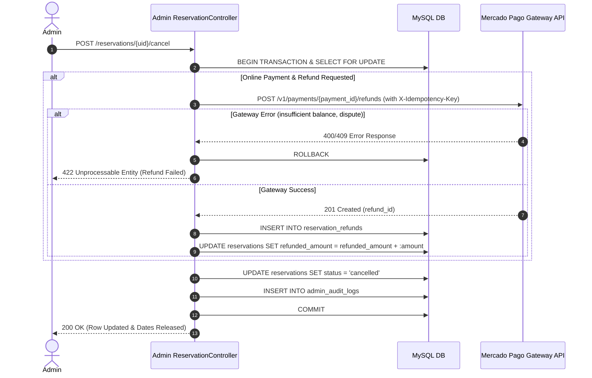

# Admin Operational Workflows: Reservations, Access Credentials, and Manual Bookings

**Issue**: [#29](https://github.com/manuelhe/oceanviewflats/issues/29)  
**Parent Map**: [#24](https://github.com/manuelhe/oceanviewflats/issues/24)  
**Dependencies**: [Issue #26 (Refund Protocol)](../research/mercadopago-refund-protocol.md), [Issue #27 (Schema)](https://github.com/manuelhe/oceanviewflats/issues/27), [Issue #28 (Auth & Security)](admin-authentication-and-security.md)

---

## 1. Overview & Architecture

This specification formalizes the four primary operational workflows within the OceanViewFlats Admin PMS interface (`admin/src/Controllers/ReservationController.php`):
1. **Filtering & Inspecting Reservations and Guest Registries**
2. **Guest Registry Manual Completion & Door Access PIN Overrides**
3. **Manual Reservation Creation (Payment Bypass)**
4. **Cancellations & Automated Mercado Pago Refund Execution**

All operational mutations must:
* Verify the user's active session (`AuthMiddleware`) and CSRF token (`CsrfMiddleware`).
* Execute critical multi-step writes inside a database transaction with row locks (`FOR UPDATE`).
* Record immutable before/after state snapshots via `AuditLogger::log()` into `admin_audit_logs`.
* Return reactive HTMX partials or trigger `HX-Trigger` / `HX-Redirect` response headers.

---

## 2. Workflow 1: Filtering/Searching Reservations & Inspecting Registries

### Controller Endpoints
* **`GET /reservations`**:
  * **Query Parameters**:
    * `property_id`: `'1606' | '1707' | 'all'` (default `'all'`)
    * `status`: `'confirmed' | 'pending_payment' | 'cancelled' | 'all'` (default `'all'`)
    * `registry_status`: `'completed' | 'pending' | 'all'` (default `'all'`)
    * `source`: `'web' | 'cash' | 'bank_transfer' | 'owner_stay' | 'manual_override' | 'all'`
    * `search`: string (matches guest name, email, phone, or `reservation_uid`)
    * `check_in_from` / `check_in_to`: `YYYY-MM-DD`
    * `page`: integer (default 1), `limit`: integer (default 25)
  * **View Response**:
    * Full page `admin/src/Views/reservations/index.php` for direct visits.
    * Table partial `admin/src/Views/reservations/_table.php` if `HTTP_HX_REQUEST` is present.

* **`GET /reservations/{uid}`**:
  * Returns reservation details, payment status, door code, registry status, audit log history, and refund ledger entries.
  * Partial `admin/src/Views/reservations/_detail_drawer.php`.

* **`GET /reservations/{uid}/registry`**:
  * Queries `guest_registries` by `reservation_uid`.
  * Displays structured companion guests (`guests_payload` JSON), document IDs, nationalities, vehicle license plates (`car_plates`), model, IP address, and submission timestamp.
  * Partial `admin/src/Views/reservations/_registry_modal.php`.

### HTMX Interactions
```html
<!-- Live Debounced Search & Filter Form -->
<form hx-get="/reservations" 
      hx-target="#reservations-table-container" 
      hx-trigger="keyup changed delay:300ms from:#search-input, change from:select, change from:input[type=date]"
      hx-indicator="#table-spinner">
    <input type="search" id="search-input" name="search" placeholder="Search guest, email, phone, or UID...">
    <select name="property_id">
        <option value="all">All Flats</option>
        <option value="1606">Apto 1606</option>
        <option value="1707">Apto 1707</option>
    </select>
    <select name="status">
        <option value="all">All Statuses</option>
        <option value="confirmed">Confirmed</option>
        <option value="pending_payment">Pending Payment</option>
        <option value="cancelled">Cancelled</option>
    </select>
</form>

<div id="reservations-table-container">
    <!-- _table.php partial injected here -->
</div>
```

---

## 3. Workflow 2: Manual Registry Completion & Door PIN Overrides

### Controller Endpoints
* **`POST /reservations/{uid}/registry/complete`**:
  * Marks `reservations.registry_completed = 1` and `registry_completed_at = NOW()`.
  * If `door_code` is `NULL`, automatically generates access credential via `DoorCodeGenerator`.
  * Returns updated registry status pill `_registry_status_pill.php`.
* **`POST /reservations/{uid}/door-code/override`**:
  * Sets custom door PIN (e.g. guest requests matching existing PIN or building emergency code).
  * Payload: `door_code` (`string`, regex: `/^[0-9]{4,10}#?$/`).
  * Updates `reservations.door_code = :door_code`.
  * Returns updated PIN container `_door_code_display.php`.
* **`POST /reservations/{uid}/door-code/regenerate`**:
  * Invokes `DoorCodeGenerator::generateForProperty($propertyId)` and updates `reservations.door_code`.

### Validation Rules
* Reservation must exist and must not be in `cancelled` status.
* Door PIN must contain only digits (4–10 chars) optionally followed by `#`.

### Audit Log Schema
```json
{
  "action": "pin_override",
  "entity_type": "reservation",
  "entity_id": "9b1deb4d-3b7d-4bad-9bdd-2b0d7b3dcb6d",
  "payload_before": { "door_code": "0160600#" },
  "payload_after": { "door_code": "582910#" }
}
```

---

## 4. Workflow 3: Creating Manual Reservations (Payment Bypass)

### Modal Lifecycle & Reactive Validation Matrix
The manual reservation creation modal (`_create_modal.php`) enforces client-side reactive gating and real-time operator feedback before any form submission can occur:
1. **Initial Submit Lock**:
   * The submit button (`#create-submit-btn`) is initialized in a disabled state (`disabled`, `aria-disabled="true"`, `class="... opacity-50 cursor-not-allowed"`).
   * A dynamic guidance element (`#create-submit-helper`) is rendered directly below the action buttons, initially prompting `"Select available dates to enable creation"`.
2. **Date Range Auto-Synchronization**:
   * Changing `#create-check-in` dynamically adjusts `#create-check-out.min` to `check_in + 1 day`.
   * If `#create-check-out` has a value on or before `#create-check-in`, it is auto-advanced to `check_in + 1 day`.
3. **Asynchronous Availability Signaling**:
   * Changing property, check-in, or check-out triggers an HTMX POST to `/reservations/quote-preview`.
   * HTMX lifecycle listeners update the submit button to `"Checking availability..."` (disabled) during the in-flight request.
   * The quote preview partial (`_quote_preview.php`) wraps its output in `#quote-preview-result` with declarative metadata `data-available="true"` or `data-available="false"`.
   * An inline script dispatches the `availabilityChecked` custom DOM event on `#create-reservation-form` containing `{ available: bool, conflictReasons: array, defaultPrice: float|null }`.
4. **Source-Dependent Validation Matrix**:
   * An input listener across `#create-reservation-form` re-evaluates the validation matrix:
     * **Property**: Must be `'1606'` or `'1707'`.
     * **Dates**: `check_in` and `check_out` must be present and `check_out > check_in`.
     * **Availability**: Must be confirmed available (`isAvailable === true`). If conflicting, helper indicates `"Resolve date conflict above to proceed"`.
     * **Price**: `total_price` must be numeric and `>= 0`.
     * **Source-Specific Rules**:
       * **Airbnb (`source=airbnb`)**: Requires non-empty `external_confirmation_code` (`"Airbnb confirmation code required"`). Guest email and phone are optional.
       * **Direct Stays (`bank_transfer`, `cash`, `owner_stay`, `manual_override`)**: Requires non-empty `guest_name`, valid email regex (`"Guest name and email required"`), and phone length between 7 and 25 characters (`"Guest phone number must be 7-25 characters"`).
   * When all validations pass, the submit button is unlocked (`disabled = false`, `aria-disabled="false"`, `opacity-50 cursor-not-allowed` removed), and `#create-submit-helper` is hidden.
   * `keydown` (Enter key) and `submit` events are intercepted via `preventDefault()` when `validateForm()` fails, eliminating accidental blank or conflicting submissions.

### Controller Endpoints
* **`GET /reservations/new`**: Renders modal creation dialog `_create_modal.php`. Supports query parameters `source` (defaulting to direct or `airbnb`), `property_id`, and prefilled dates.
* **`POST /reservations/quote-preview`**:
  * Validates date availability via `ReservationLedger->getConflictReasons()`.
  * Calculates suggested total price via `QuoteEngine`.
  * Returns quote preview partial `_quote_preview.php` with `data-available` attribute and `availabilityChecked` event dispatch.
* **`POST /reservations/create-manual`**:
  * **Payload**:
    * `property_id`: `'1606' | '1707'`
    * `check_in`: `YYYY-MM-DD` (strict date format validation)
    * `check_out`: `YYYY-MM-DD` (strict date format validation, strictly after `check_in`)
    * `guest_name`: string (2-120 chars)
    * `guest_email`: valid email (optional for Airbnb)
    * `guest_phone`: string (7-25 chars, optional for Airbnb)
    * `total_price`: decimal >= 0.00
    * `source`: `'airbnb' | 'cash' | 'bank_transfer' | 'owner_stay' | 'manual_override'` (strict whitelist validation)
    * `external_confirmation_code`: string (required if `source === 'airbnb'`)
    * `channel_block_uid`: optional string (for linking/absorbing existing iCal calendar blocks)
    * `notes`: optional text
    * `pre_mark_registry`: boolean (if checked, marks guest registry completed immediately)
    * `send_confirmation_email`: boolean
  * **Execution**:
    1. Validate input strictly: date format `Y-m-d`, source whitelist, email regex (for direct stays), phone length (for direct stays), Airbnb confirmation code (for Airbnb stays).
    2. Check `ReservationLedger->isAvailable($propertyId, $checkIn, $checkOut, null, $absorbingSource)`.
       * If false, invoke `$this->ledger->getConflictReasons(...)` to extract specific itemized conflicting reservation UIDs or block labels.
       * Re-render `_create_modal.php` with HTTP 422: displaying the specific conflict banner and **preserving 100% of operator input across all submitted fields** (`renderCreateError`).
    3. Acquire atomic database transaction.
    4. Generate `reservation_uid` (`res-abnb-*` for Airbnb, `res-man-*` for manual/direct).
    5. Set `status = 'confirmed'`, `payment_status = 'approved'`, `source = :source`.
    6. If `channel_block_uid` is provided, absorb/delete the corresponding channel block to prevent double-counting.
    7. Generate initial door code via `DoorCodeGenerator`.
    8. Commit transaction.
    9. Emit `admin_audit_logs` entry.
    10. Send confirmation email if requested.
    11. Return `HX-Redirect: /reservations/{uid}` or row prepend with success toast.


---

## 5. Workflow 4: Cancellations & Automated Mercado Pago Refunds

### Controller Endpoints
* **`GET /reservations/{uid}/cancel-modal`**:
  * Renders `_cancel_modal.php`.
  * If `mercadopago_payment_id` is present, displays refund options:
    * **Full Refund**: Automatically calculates `refundable = total_price - refunded_amount`.
    * **Partial Refund**: Allows entering specific COP amount (`0 < amount <= refundable`).
    * **No Refund / Policy Retention**: Cancel booking without refunding.
* **`POST /reservations/{uid}/cancel`**:
  * **Payload**:
    * `reason`: string (min 3 chars, required)
    * `refund_type`: `'full' | 'partial' | 'none'`
    * `refund_amount`: decimal (required if `refund_type == 'partial'`)
    * `notes`: optional text

### Execution Protocol & Webhook Invariant


#### Terminal Cancellation Invariant
Once `reservations.status = 'cancelled'`, date availability is immediately released (`Reservation::isHolding()` evaluates to `false`). Any subsequent Mercado Pago asynchronous webhooks received by `public/api/mercadopago-webhook.php` must treat `cancelled` as terminal and **never** overwrite or resurrect the reservation back to `confirmed` or `pending_payment`.
