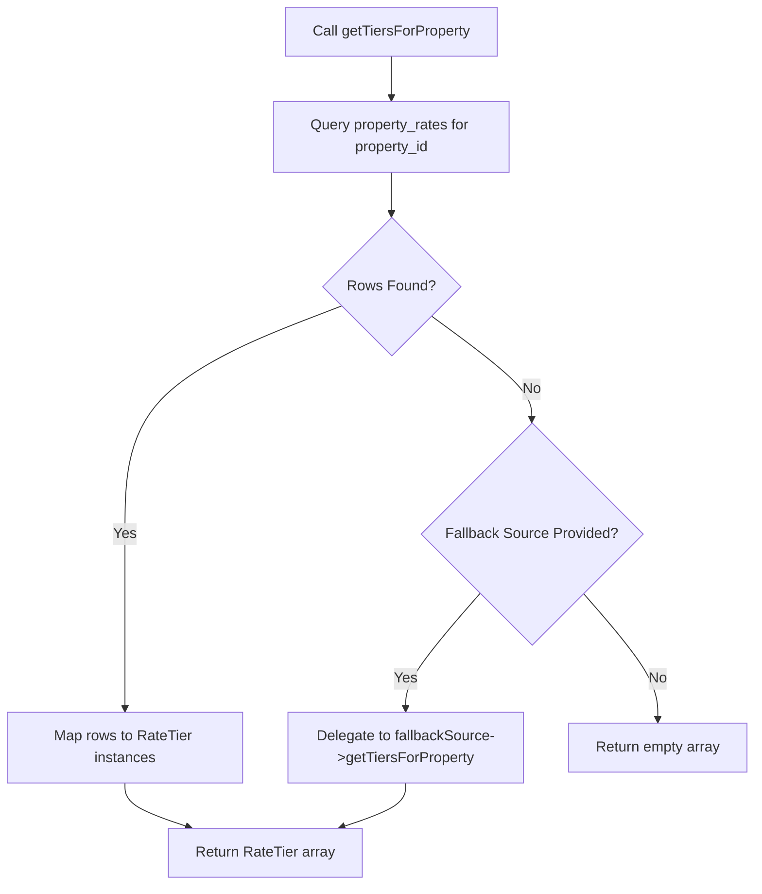

# Database Rate Source (PdoRateSource) & Seasonal Pricing Editor Specification

**Issue**: [#30](https://github.com/manuelhe/oceanviewflats/issues/30)  
**Parent Map**: [#24](https://github.com/manuelhe/oceanviewflats/issues/24)  
**Dependencies**: [Issue #27 (Database Schema)](https://github.com/manuelhe/oceanviewflats/issues/27), [Issue #28 (Auth & Security)](admin-authentication-and-security.md)

---

## 1. Architectural Role & Context

In [ADR 0004](../adr/0004-authoritative-quote-engine-and-itemized-pricing.md), seasonal rates and minimum stay policies were loaded from a static CSV file (`public/data/prices.csv`) via `CsvRateSource` implementing `RateSourceInterface`.

With the establishment of the administrative PMS interface, pricing is transitioned to live database management via `property_rates` while maintaining:
1. Strict adherence to `RateSourceInterface` so the existing domain `QuoteEngine` remains 100% decoupled and unaffected.
2. Full backwards-compatible fallback to `CsvRateSource` during migration or cold database starts.
3. Automated CSV seeding utilities to populate initial seasonal tiers without manual data re-entry.
4. An administrative HTMX-powered Seasonal Pricing Editor with date overlap prevention and gap warnings.

---

## 2. PdoRateSource Implementation Contract

`PdoRateSource` resides in `src/Domain/Quote/PdoRateSource.php` under namespace `OceanViewFlats\Domain\Quote\`.

### Class Signature & Dependencies
```php
namespace OceanViewFlats\Domain\Quote;

use InvalidArgumentException;
use PDO;
use RuntimeException;

final class PdoRateSource implements RateSourceInterface
{
    public function __construct(
        private readonly PDO $pdo,
        private readonly ?RateSourceInterface $fallbackSource = null
    ) {}

    /**
     * @return array<int, RateTier>
     */
    public function getTiersForProperty(string $propertyId): array;

    /**
     * Checks whether a proposed date range collides with an existing tier for the property.
     */
    public function hasOverlap(
        string $propertyId,
        string $startDate,
        string $endDate,
        ?int $excludeId = null
    ): bool;

    /**
     * Populates property_rates from prices.csv if not already populated.
     */
    public function seedFromCsv(string $csvFilePath, ?int $createdBy = null): int;
}
```

### Retrieval & Fallback Algorithm


---

## 3. Date Overlap & Contiguity Validation Rules

### Overlap Invariant
A property must never have two conflicting rates for the same night. The overlap condition between an existing interval `[S_e, E_e]` and a proposed interval `[S_p, E_p]` is:
$$\text{Overlap} \iff S_e \le E_p \land E_e \ge S_p$$

In SQL:
```sql
SELECT COUNT(*) 
FROM property_rates 
WHERE property_id = :property_id 
  AND start_date <= :end_date 
  AND end_date >= :start_date
  AND id != :exclude_id
```

### Validation Constraints
* `property_id`: Valid property identifier (`'1606' | '1707'`).
* `start_date`: Valid `YYYY-MM-DD` string.
* `end_date`: Valid `YYYY-MM-DD` string, strictly greater than `start_date`.
* `price_per_night`: Numeric float $> 0.00$.
* `min_stay`: Positive integer $\ge 1$.
* `season_name`: Non-empty descriptive string (e.g., "High Season - Christmas & New Year", "Standard Low Season").

### Year-Round Coverage & Gap Warnings
While non-overlapping dates are strictly enforced as a blocking error (HTTP 422), unpriced gaps between tiers are permitted by the engine (which falls back to the property default rate). The Seasonal Pricing Editor displays a visual gap warning indicator in the timeline:
> `⚠️ Notice: Unpriced window detected between 2026-08-16 and 2026-11-30. Bookings during this period will use the default base rate.`

---

## 4. Seasonal Pricing Editor: Controller & HTMX Interaction

The administrative editor is exposed via `admin/src/Controllers/RateController.php`.

### Controller Endpoints
| HTTP Method | Route | Purpose | Response |
|---|---|---|---|
| `GET` | `/rates` | Main pricing dashboard with property tabs and seasonal timeline | Full page `rates/index.php` or table partial `_rates_table.php` |
| `GET` | `/rates/new` | Render creation modal for seasonal tier | Modal partial `_modal_form.php` |
| `POST` | `/rates` | Store new seasonal rate tier | Updated table partial + toast notification |
| `GET` | `/rates/{id}/edit` | Render edit modal for existing tier | Modal partial `_modal_form.php` |
| `POST` / `PUT` | `/rates/{id}` | Update existing seasonal rate tier | Updated table partial + toast notification |
| `DELETE` | `/rates/{id}` | Remove seasonal rate tier | Updated table partial + toast notification |
| `POST` | `/rates/seed-from-csv` | Trigger CSV seed import | Summary modal / banner |

### HTMX Component Snippets
```html
<!-- Property Tab Selector -->
<div class="flex space-x-4 border-b border-gray-200 mb-6">
    <button hx-get="/rates?property_id=1606" 
            hx-target="#rates-view-container"
            class="pb-2 font-medium text-blue-600 border-b-2 border-blue-600">
        Apto 1606 Rates
    </button>
    <button hx-get="/rates?property_id=1707" 
            hx-target="#rates-view-container"
            class="pb-2 font-medium text-gray-500 hover:text-gray-700">
        Apto 1707 Rates
    </button>
</div>

<!-- Modal Form with Overlap Validation -->
<form hx-post="/rates" 
      hx-target="#rates-view-container" 
      hx-swap="innerHTML"
      class="space-y-4">
    <input type="hidden" name="property_id" value="1606">
    <div>
        <label>Season Name</label>
        <input type="text" name="season_name" placeholder="e.g. Easter Holiday" required>
    </div>
    <div class="grid grid-cols-2 gap-4">
        <div>
            <label>Start Date</label>
            <input type="date" name="start_date" required>
        </div>
        <div>
            <label>End Date</label>
            <input type="date" name="end_date" required>
        </div>
    </div>
    <div class="grid grid-cols-2 gap-4">
        <div>
            <label>Nightly Rate (COP)</label>
            <input type="number" name="price_per_night" min="50000" step="5000" required>
        </div>
        <div>
            <label>Minimum Stay (Nights)</label>
            <input type="number" name="min_stay" min="1" max="30" value="2" required>
        </div>
    </div>
    <div id="form-error-feedback" class="text-sm text-red-600"></div>
    <button type="submit">Save Seasonal Rate</button>
</form>
```

---

## 5. Audit Logging Invariants

Every administrative modification to seasonal pricing is recorded in `admin_audit_logs`:
* **Creation**:
  ```json
  {
    "action": "rate_tier_created",
    "entity_type": "property_rates",
    "entity_id": "3",
    "payload_after": {
      "property_id": "1606",
      "season_name": "Easter Holiday",
      "start_date": "2026-03-28",
      "end_date": "2026-04-05",
      "price_per_night": 480000.0,
      "min_stay": 3
    }
  }
  ```
* **Update**:
  Captures exact delta in `payload_before` and `payload_after`.
* **Deletion**:
  Captures complete deleted row in `payload_before` for disaster recovery.
